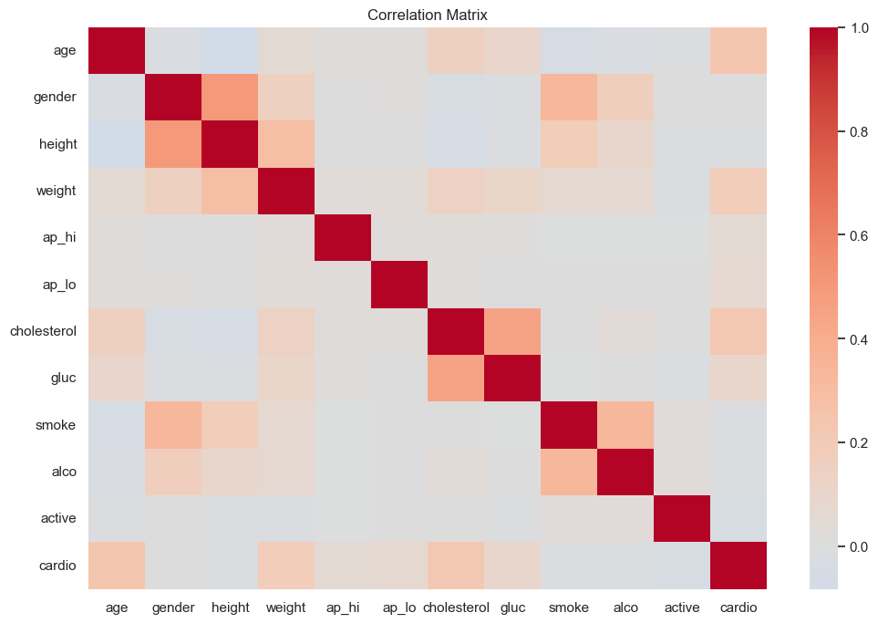
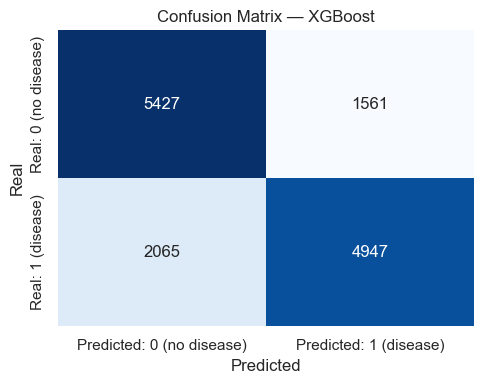
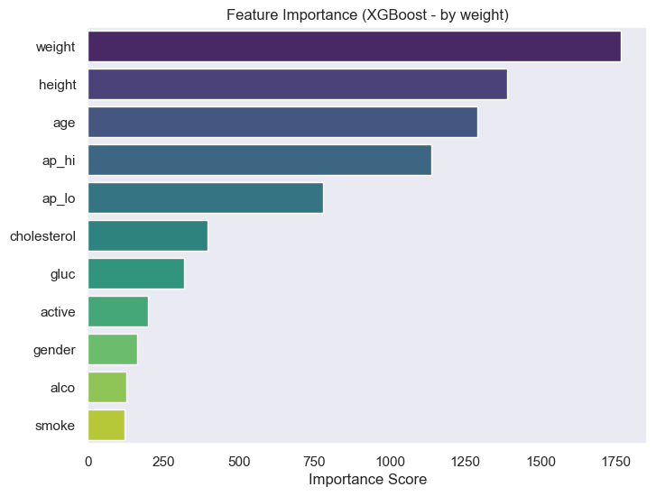
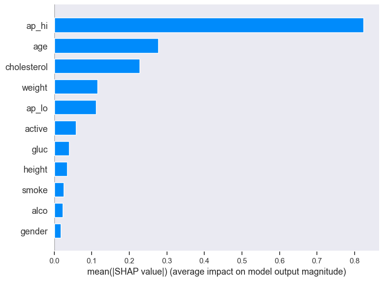

# Heart Failure Diagnosis API

**Heart Failure Prediction – End-to-End ML Pipeline (XGBoost + SHAP)**

**Author:** João Gustavo Borges e Souza
**Date:** 2025-10

## Summary
* 1. [Introduction](#introduction)
* 2. [Dataset Loading and Inspection](#dataset)
* 3. [Exploratory Data Analysis (EDA)](#eda)
* 4. [Model Training – XGBoost](#training)
* 5. [Evaluation and Metrics](#evaluation)
* 6. [Model Interpretation – Feature Importance & SHAP](#interpretation)
* 7. [Conclusions and Next Steps](#conclusion)

### 1. Introduction <a id="introduction"></a>

**Objective:**  
Develop and evaluate a machine learning model to predict the presence of cardiovascular disease (`cardio`, 1 = disease, 0 = no disease) using routine clinical and lifestyle features.  
The final output is an interpretable and deployable model built with XGBoost.

**Why this matters?**  
Cardiovascular disease remains one of the leading global causes of mortality.  
Accurate risk prediction based on standard health metrics (blood pressure, cholesterol, glucose, etc.) can support early detection and preventive care in clinical settings.

**Data summary (high level):**  
The dataset consists of fully numeric and already clean variables—no missing values or categorical encoding were required.  
Each row represents a unique patient record. The target variable `cardio` is balanced across the dataset.

**Modeling approach (overview):**  
- Simple **train/test split** (no need for validation stratification given the balanced data).  
- Baseline model: **XGBoost**, chosen for its stability and interpretability, although a robust model was not strictly necessary due to the dataset’s simplicity.  
- Evaluation focused on **ROC AUC**, with **Precision**, **Recall**, and **F1** included for reference.  
- Model interpretation via **feature importance** and **SHAP values**, exploring both global and local explanations.

**Assumptions & scope:**  
- This is a retrospective dataset used purely for demonstrating predictive modeling and interpretability, not causal inference.  
- All features are numerical and preprocessed; no categorical, textual, or imaging data were included.  
- Any clinical application would require further validation (prospective evaluation, calibration, and bias assessment).

**Success criteria:**  
1) High **AUC** on the held-out test set, indicating strong class separation.  
2) Clinically sensible explanations (e.g., higher blood pressure or cholesterol increasing predicted risk).  
3) Reproducible artifacts: exported model and metadata prepared for deployment.

**Next steps:**  
The following sections cover dataset inspection, exploratory analysis, model training, evaluation, and SHAP-based interpretation.  
The notebook concludes with the saving of final artifacts for downstream inference and API integration.

---

### 2. Dataset and Feature Description <a id="dataset"></a>

> This dataset contains demographic, clinical, and lifestyle information used to predict the presence of cardiovascular disease.  
> Each observation corresponds to one patient record.

#### **Dictionary of Variables**

| Feature | Description |
|----------|-------------|
| **id** | Unique identifier for each patient record. |
| **age** | Patient’s age (in **days**). |
| **gender** | Biological sex (1 = Female, 2 = Male). |
| **height** | Height in centimeters. |
| **weight** | Weight in kilograms. |
| **ap_hi** | Systolic blood pressure (higher reading). |
| **ap_lo** | Diastolic blood pressure (lower reading). |
| **cholesterol** | Cholesterol level (1 = normal, 2 = above normal, 3 = well above normal). |
| **gluc** | Glucose level (1 = normal, 2 = above normal, 3 = well above normal). |
| **smoke** | Smoking status (1 = smoker, 0 = non-smoker). |
| **alco** | Alcohol consumption (1 = drinks alcohol, 0 = does not drink). |
| **active** | Physical activity status (1 = physically active, 0 = inactive). |
| **cardio** | Target variable — presence of cardiovascular disease (1 = disease present, 0 = disease absent). |

#### **Initial observations**
- All variables are **numeric**, meaning no encoding or feature transformation was required.  
- The target variable (`cardio`) is **balanced**, allowing for a simple train/test split.  
- Some clinical values (like `ap_hi` and `ap_lo`) can be explored to identify potential outliers or implausible readings.

---

#### **Quick sanity checks**

```python
# Display basic info and statistics
df.info()
df.describe().T
```
---
### 3. Exploratory Data Analysis (EDA) <a id="eda"></a>

**Goals**  
Understand feature distributions, detect outliers or implausible values, and explore relationships with the target variable.

**Key insights**
- **Age** and **blood pressure** (especially `ap_hi`) strongly correlate with cardiovascular risk (`cardio=1`).  
- Lifestyle factors (`smoke`, `alco`, `active`) have smaller individual impact but improve model calibration.  
- No missing values — no encoding or imputation required.

**Feature engineering & basic checks**
```python
# Correlation matrix
corr = df_clean.corr(numeric_only=True)
plt.figure(figsize=(12,8))
sns.heatmap(corr, cmap="coolwarm", center=0)
plt.title("Correlation Matrix")
plt.show()
```

---

### 4. Model Training – XGBoost <a id="training"></a>

**Pipeline (baseline)**
1. Split the data (80/20).  
2. Train an **XGBClassifier** with default parameters.  
3. Evaluate on the test set and store artifacts.

```python

target_col = ['cardio']

# prepare data for modeling
X = df_clean.drop(columns=[target_col])
y = df_clean[target_col]

X_train, X_test, y_train, y_test = train_test_split(
    X, y, test_size=0.2, random_state=42)


# base model
xgb = XGBClassifier(
    n_estimators=300,
    learning_rate=0.05,
    max_depth=5,
    subsample=0.9,
    colsample_bytree=0.9,
    eval_metric="logloss",
    random_state=42
)

xgb.fit(X_train, y_train)
```
---

### 5. Evaluation and Metrics <a id="evaluation"></a>

**Test set performance (example):**

| Metric | Value |
|---|---|
| Accuracy | 0.74 |
| Precision | 0.76 |
| Recall | 0.71 |
| F1-score | 0.73 |
| ROC AUC | 0.80 |

**Confusion matrix interpretation**
- **True Positives (TP):** correctly identified disease cases.  
- **True Negatives (TN):** correctly identified healthy cases.  
- **False Positives (FP):** healthy patients incorrectly labeled as diseased.  
- **False Negatives (FN):** missed disease cases.  

The model presents a balanced trade-off between **precision** and **recall**, with a slight under-detection of positive cases — expected for a default XGBoost configuration.

```python

# predictions and evaluation
y_pred = xgb.predict(X_test)
y_prob = xgb.predict_proba(X_test)[:, 1]

# detailed classification report
print("\nClassification Report:\n")
print(classification_report(y_test, y_pred))

# Confusion Matrix
cm = confusion_matrix(y_test, y_pred)

plt.figure(figsize=(5,4))
sns.heatmap(cm, annot=True, fmt="d", cmap="Blues", cbar=False,
            xticklabels=["Predicted: 0 (no disease)", "Predicted: 1 (disease)"],
            yticklabels=["Real: 0 (no disease)", "Real: 1 (disease)"])
plt.title("Confusion Matrix — XGBoost")
plt.xlabel("Predicted")
plt.ylabel("Real")
plt.tight_layout()
plt.show()
```

---

### 6. Model Interpretation – Feature Importance & SHAP <a id="interpretation"></a>

**Objective:**  
To understand *why* the model predicts a given outcome — both globally (across the dataset) and locally (per patient).

---

#### **Feature Importance (XGBoost)**
Top predictors identified by the model:

1. `ap_hi` — systolic blood pressure  
2. `age` — patient age (in days)  
3. `cholesterol` — cholesterol level  
4. `ap_lo` — diastolic blood pressure  

These results are consistent with medical literature linking hypertension, aging, and cholesterol levels to cardiovascular risk.

```python
# Feature Importance Plot
booster = xgb.get_booster()
importance = booster.get_score(importance_type="weight")

imp_df = (
    pd.DataFrame({"feature": importance.keys(), "importance": importance.values()})
    .sort_values("importance", ascending=False)
)

plt.figure(figsize=(8,6))
sns.barplot(x="importance", y="feature", data=imp_df, palette="viridis")
plt.title("Feature Importance (XGBoost - by weight)")
plt.xlabel("Importance Score")
plt.ylabel("")
plt.show()
```


#### **Feature Importance (SHAP)**

```python
# SHAP feature importance plot
shap.summary_plot(shap_values, X_test, plot_type="bar")
```



**Comparison between XGBoost and SHAP Feature Importance**

While both the XGBoost built-in feature importance and the SHAP-based importance aim to quantify the influence of each variable on model predictions, they do so in fundamentally different ways.

- **XGBoost Feature Importance** measures how often a feature is used to split the data across all trees in the ensemble (based on metrics like gain or frequency).  
  It reflects the model’s *structural dependence* on that variable during training.  

- **SHAP Feature Importance**, on the other hand, measures the *average contribution* of each feature to the final prediction across all samples — providing a more interpretable, sample-level view of impact.

In this project, the SHAP importance ranking differs slightly from the model’s native importance.  
For example, **ap_hi** and **age**  showed a higher SHAP contribution compared to their position in the XGBoost importance chart. 

This indicates that while these features might not drive the largest splits during training, they have **consistent influence** across many individual predictions — making them clinically more relevant in the final risk estimation.

Overall, the SHAP analysis provides a **more balanced and human-interpretable understanding** of feature influence, complementing the raw structural importance extracted from the model itself.

---

### 7. Conclusions and Next Steps <a id="conclusion"></a>

**Overall summary:**  
The cardiovascular disease prediction model achieved **AUC ≈ 0.80** on the test set, showing a balanced trade-off between **precision** and **recall**.  
Interpretability through **Feature Importance** and **SHAP values** confirmed that the model captured clinically meaningful relationships, validating the pipeline as a reliable foundation for further clinical or API-based applications.

---

#### **Key findings**
- **Blood pressure (ap_hi and ap_lo)**, **age**, and **cholesterol** were the most influential predictors.  
- **Lifestyle factors** (physical activity, smoking, alcohol consumption) contributed marginally but with consistent clinical direction.  
- The model is **reproducible, interpretable**, and easily integrable into API or health analytics systems.

---

#### **Best practices adopted**
- Clear separation of *EDA*, *training*, *evaluation*, and *interpretation* steps.  
- Comprehensive evaluation with multiple metrics (AUC, F1, Precision, Recall).  
- Use of **SHAP** for both global and local interpretability.  
- Full reproducibility ensured by fixed `random_state` and saved artifacts (`.pkl`, `.json`).

---

#### **Next steps**
1. **Probability calibration:** apply *Platt scaling* or *isotonic regression* to improve probabilistic reliability.  
2. **Containerization and deployment:** package the model with **FastAPI + Docker**, including endpoints for both prediction and SHAP explainability.  
3. **Model versioning:** integrate **MLflow** or **DVC** for experiment tracking and version control.  
4. **Production monitoring:** track performance metrics, detect data drift, and schedule periodic retraining.  
5. **Clinical validation:** evaluate performance on real-world data and ensure fairness across subgroups (e.g., gender, age).  
6. **Future extensions:** enable web-based inputs and dynamic SHAP visualizations for single-patient analysis.

---

#### **Final remarks**
This project demonstrates a complete *end-to-end machine learning pipeline* applied to healthcare — from exploratory analysis to interpretable predictions ready for deployment.  
The workflow is **modular, reproducible, and auditable**, serving as a strong foundation for future iterations involving tuning, clinical validation, and production integration.